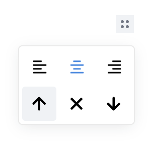

# Editor js iframe plugin

Provides iframe support for the [Editor.js](https://editorjs.io).

Works only with pasted iframe tags and requires no server-side setup.


## Installation

### Install via NPM

Get the package

```shell
npm i --save-dev @hammaadhrasheedh/editorjs-iframe
```

Include module at your application

```javascript
const Iframe = require('@hammaadhrasheedh/editorjs-iframe');
```

### Download to your project's source dir

1. Upload folder `dist` from repository
2. Add `dist/bundle.js` file to your page.

Then require this script on page with Editor.js.

```html
<script src="..."></script>
```

## Usage

Add a new Tool to the `tools` property of the Editor.js initial config.

```javascript
var editor = EditorJS({
  ...
  
  tools: {
    ...
    iframe: Iframe,
  }
  
  ...
});
```

## Config Params

This Tool has no config params

## Tool's settings



1. Left align

2. Center align

3. Right align

## Output data

| Field          | Type      | Description                     |
| -------------- | --------- | ------------------------------- |
| frame            | `string`  | iframe                      |
| alignment      | `string` | alignment of iframe |


```json
{
    "type" : "image",
    "data" : {
        "frame" : "<iframe width=\"560\" height=\"315\" src=\"https://www.youtube.com/embed/n9Hn2J9_n7k\" title=\"YouTube video player\" frameborder=\"0\" allow=\"accelerometer; autoplay; clipboard-write; encrypted-media; gyroscope; picture-in-picture\" allowfullscreen=\"\"></iframe>",
        "alignment" : "Centered",
    }
}
```
